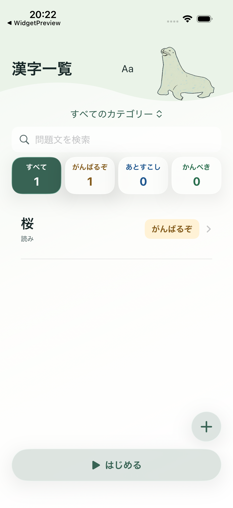
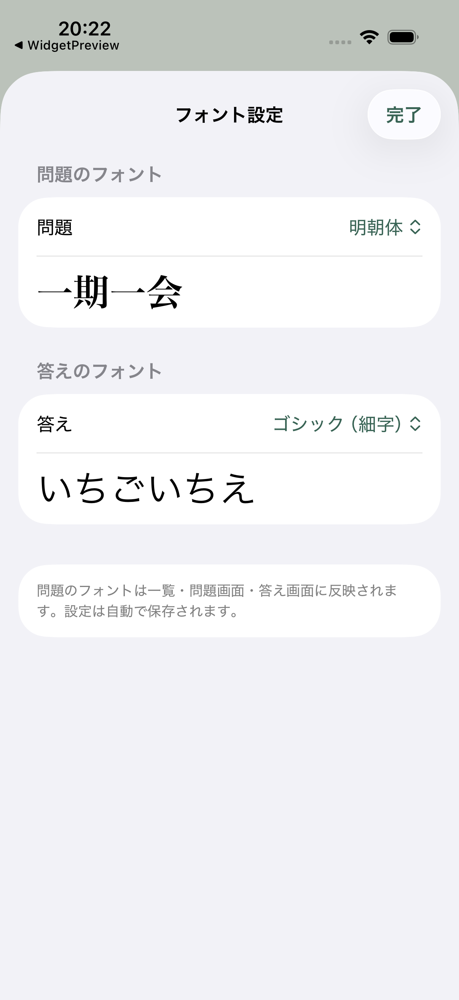
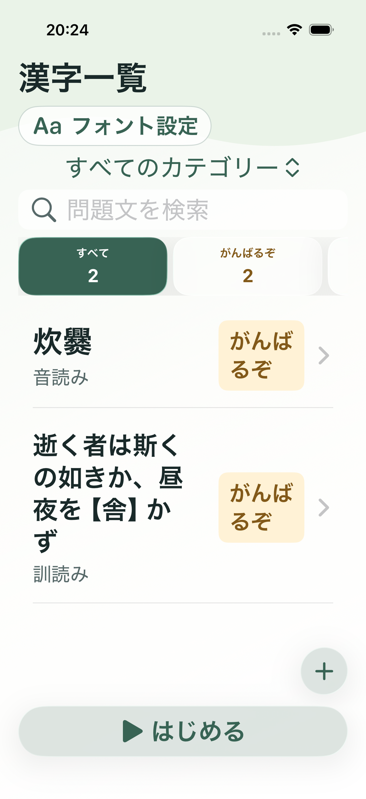

# ホーム画面とフォント設定のデザイン評価

> このレポートはタイトル下へ配置した時点の評価です。その後の要望により、現在の設定ボタンは右下の「＋」の真上にあるフローティングの歯車アイコンへ変更しています。

2026-10-07。対象はiPhoneアプリの「漢字一覧」から「フォント設定」を開く導線です。今回の実行で撮影したシミュレーター画像を使用しています。

## 1. 変更前のホーム画面 — 入口の発見に課題

- **良い点:** 淡い緑とキャラクターの雰囲気が統一され、カテゴリー、検索、習熟度、問題一覧の順に情報を追えます。習熟度は色だけでなく文字でも区別できます。
- **優先度の高い問題:** 「Aa」だけではフォント設定という用途が伝わりません。タイトルとキャラクターの間に独立して置かれ、背景や輪郭もないため、押せる操作に見えにくくなっています。
- **改善方針:** タイトル直下に「フォント設定」の文字ラベルを付けたボタンを置き、画面の設定としてひとまとまりにします。白い背景、緑の文字、細い輪郭で操作できる場所を示します。
- **その他の観察:** 「はじめる」は幅と下部の位置で目立ちますが、色の強さは習熟度の選択状態より控えめです。今回の変更対象は設定の入口とし、学習開始の強調は別途検討できる点です。1件のテストデータによる余白を、通常のデータ量でも生じる問題とは判断していません。

## 2. フォント設定画面 — 選択と結果の関係は明確

- **良い点:** 問題・答えが別々のセクションになり、現在の選択名と実際の文字のプレビューを同じ場所で確認できます。明朝体の違いも視覚的にわかります。
- **良い点:** 自動保存の説明と「完了」があり、変更後の操作を判断できます。
- **留意点:** 選択候補はメニューを開くまで見えません。現状の3候補では操作数は少なく、今回の主要な問題はホームからの入口でした。

## 3. 改善後のホーム画面 — 名前とボタン形状で発見しやすく改善

- 「漢字一覧」のすぐ下に「フォント設定」を配置しました。
- アイコンに文字を添え、白い背景と細い輪郭で、装飾と操作を区別しました。
- キャラクターは右側にまとめ、タイトル・設定の並びと競合しないようにしました。
- タップ領域は高さ44pt以上。検索中に開くとキーボードのフォーカスを外します。
- スクロールしてヘッダーが縮んでも設定ボタンを残します。ラベルを残すため、従来より縮小後のヘッダーは少し高くなります。

## 4. 大きな文字のホーム画面 — レイアウト確認

大きな文字では既存の方針に合わせてキャラクターを非表示にし、タイトルと設定ボタンの幅を確保します。

## 検証と限界

- 通常文字とアクセシビリティ向けの大きな文字で画面を撮影し、見切れや重なりを確認。
- 設定画面への遷移、問題・答えの別々の設定、再起動後の保持をUIテストで確認。
- スクロールによるヘッダー縮小と、絞り込み後の位置維持を確認。
- VoiceOverの実際の読み上げ順、外部キーボード操作、全機種・全文字サイズ、実機での見え方は未検証です。スクリーンショットだけからアクセシビリティ適合を断定しません。
